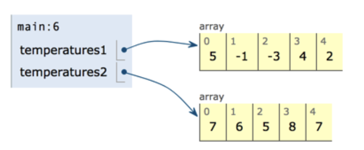
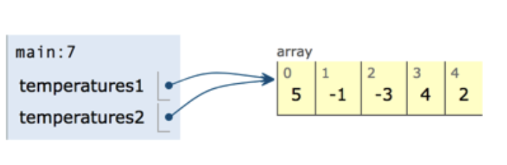

# 4.2 Working With Arrays

* [Arrays as Reference Data Types](https://github.com/SACHSTech/ICS3U1_lesson_4_2_WorkingWithArrays/main/README.md#arrays-as-reference-data-types)
* [Processing Arrays with Loops](https://github.com/SACHSTech/ICS3U1_lesson_4_2_WorkingWithArrays/blob/main/README.md#processing-arrays-with-loops)
  * [Reading Values](https://github.com/SACHSTech/ICS3U1_lesson_4_2_WorkingWithArrays/blob/main/README.md#reading-in-values)
  * [The length field](https://github.com/SACHSTech/ICS3U1_lesson_4_2_WorkingWithArrays/blob/main/README.md#the-length-field)
  * [Outputting Values](https://github.com/SACHSTech/ICS3U1_lesson_4_2_WorkingWithArrays/blob/main/README.md#outputting-an-array-with-a-loop)
  * [Modifying Values](https://github.com/SACHSTech/ICS3U1_lesson_4_2_WorkingWithArrays/blob/main/README.md#modifying-values)
  * [Summing an Array](https://github.com/SACHSTech/ICS3U1_lesson_4_2_WorkingWithArrays/blob/main/README.md#summing-an-array)
  * [Searching an Array](https://github.com/SACHSTech/ICS3U1_lesson_4_2_WorkingWithArrays/blob/main/README.md#searching-an-array)


## Arrays as Reference Data Types
Arrays in Java are <ins>**REFERENCE DATA TYPES**</ins>.  This means that the array variable **holds a reference to the data in the array, not the arrays' data itself**.

### Example #1: Things to Keep in Mind with Arrays
In the example below, we have two arrays: `temperatures1` and `temperatures2`. Then on Line 8, we reassign `temperatures2` to `temperatures1`. Let's take a look at what data is stored in each array:

```java
public class Example1 extends ConsoleProgram {

    public void run() {
      
      // Initialize arrays
      int[] temperatures1 = {5, -1, -3, 4, 2};
      int[] temperatures2 = {7, 6, 5, 8, 7};

      // Reassign temperatures2 to temperatures1
      temperatures2 = temperatures1;
      System.out.println(temperatures1[1]);
      System.out.println(temperatures2[1]);

      // Updating an element value
      temperatures1[1] = 10;
      System.out.println(temperatures1[1]);
      System.out.println(temperatures2[1]);
      
      // Print out the temperatures1 array
      System.out.println(temperatures1);
    }
}
```
### Intializing the Arrays 


### Changing the Reference
```java
temperatures2 = temperatures1;
```


### The effect of this is `temperatures1` & `temperatures2` now referring to the same array. The result of the program above is:
```java
-1
-1
```

### Updating an Element
We can also update an element in the array by referring to it's index and reassigning it's value. Notice that this will also update `temperatures2`'s value because BOTH variables are pointing to the SAME array.
```java
      // Updating an element value
      temperatures1[1] = 10;
      System.out.println(temperatures1[1]);
      System.out.println(temperatures2[1]);
```

### COMMON MISTAKE!
A mistake that a lot of people make and you might still make is to try to print the array by using the variable.
```java
      // Print out the temperatures1 array
      System.out.println(temperatures1);
```

This is what the output is:
```java
[I@4554617c
```
What prints out is basically the **memory address** of the array - where Java needs to go to find the array.

## Processing Arrays with Loops

### Example #2: 
There is a lot going on in the example below. Each part is broken down in the notes below:

```java
public class Example2 extends ConsoleProgram {

  public void run() {
    
    int[] marks = new int[5];
    int total;
    double average;
    int searchMark;
    boolean markFound = false;
    
    // Assign values to each element through user input
    for (int index = 0; index < 5; index++) {
      marks[index] = readInt("Enter a mark: ");
    }

    // Output number of elements in the array
    System.out.println("\nThere are " + marks.length + " elements in the array.\n");

    // Output the marks
    for (int index = 0; index < marks.length; index++) {
      System.out.println("Mark " + (index+1) + ": " + marks[index]);
    }

    // Apply a mark boost - increase each mark by 2
    for (int index = 0; index < marks.length; index++) {
      marks[index] = marks[index] + 2;
    }

    System.out.println("");
    System.out.println("*** Marks with 2+ boost ***");

    // Output the marks with the boost
    for (int index = 0; index < marks.length; index++) {
      System.out.println("Mark " + (index+1) + ": " + marks[index]);
    }

    // Compute the average using the total marks
    total = 0;
    for (int index = 0; index < marks.length; index++) {
        total = total + marks[index];
    }
    
    average = (double)total/marks.length;
    System.out.println("\nThe average of the class is " + average);  

    // Search the array for mark
    searchMark = readInt("Enter the mark to search: ");

    for (int i = 0; i < marks.length; i++) {
      if (marks[i] == searchMark) {  // check the mark in the current position
        System.out.println(searchMark + " found in position " + i);
        markFound = true;
        break;
      }
    }

    // Checks if mark is not found
    if (!markFound) {
      System.out.println("Mark not found.");
    } 

  }
}
```

### Reading in Values
We've seen that we can initialize array elements with an initializer.  We can also use user input to set element values:

```java
    int[] marks = new int[5];
    
    // Assign values to each element through user input
    for (int index = 0; index < 5; index++) {
      marks[index] = readInt("Enter a mark: ");
    }
```

### The `length` field
The `length` field is a special property of an array that we call when we want to know the size (how many elements) of the array.
```java
    // Output number of elements in the array
    System.out.println("\nThere are " + marks.length + " elements in the array.\n");
```

### Outputting an Array with a Loop
Using the length field we can use a loop to iterate through the array and print each element:
```java
    // Output the marks
    for (int index = 0; index < marks.length; index++) {
      System.out.println("Mark " + (index+1) + ": " + marks[index]);
    }
```

### Modifying Values
We can use a loop to iterate an array and **modify** each element.  For example, we want to give each mark a boost by 2.
```java
    // Apply a mark boost - increase each mark by 2
    for (int index = 0; index < marks.length; index++) {
        marks[index] = marks[index] + 2;
        //marks[index] += 2;
    }
```

### Summing an Array
We can compute a total of an array in order to compute the average.
```java
    // Compute the average using the total marks
    total = 0;
    for(int index = 0; index < marks.length; index++) {
        total = total + marks[index];
    }
    
    average = (double)total/marks.length;
    System.out.println("\nThe average of the class is " + average);    
```

### Searching an Array
We can apply basic conditions in a our loop to search the array.  By using a loop to iterate through the array, we can check each element until we find it.  This type of search is called a **linear search**

```java
    // Search the array for mark
    searchMark = readInt("Enter the mark to search: ");

    for (int i = 0; i < marks.length; i++) {
      if (marks[i] == searchMark) {  //check the mark in the current position
        System.out.println(searchMark + " found in position " + i);
        markFound = true;
        break;
      }
    }

    // Checks if mark is not found
    if (!markFound){
      System.out.println("Mark not found");
    }
```


 	


